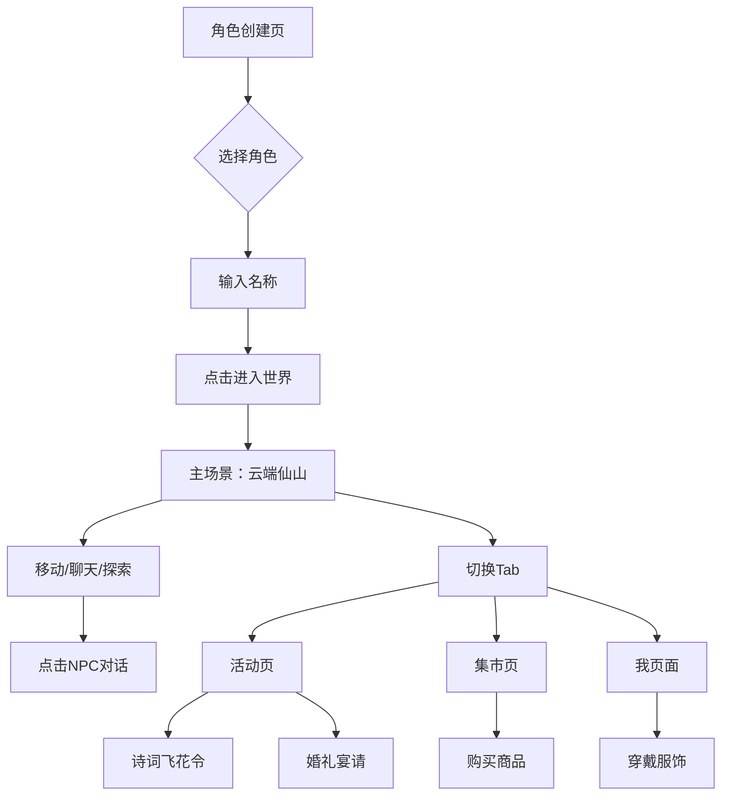

## 1. Product Overview
幻境漫游 WonderRealm 是一款2D等距视角中式奇幻社交世界Demo，用户可进入奇幻世界探索风景、与玩家互动、参加文化活动、购买虚拟服饰。核心卖点是社交感——场景中始终有其他玩家活动，单人模式下有模拟玩家填充，多人模式下实时同步。

## 2. Core Features

### 2.1 User Roles
| Role | Registration Method | Core Permissions |
|------|---------------------|------------------|
| Player | Character creation | Explore world, chat, participate in activities, buy items |
| Simulated Player | Auto-generated | Walk around, chat bubbles, social interactions |
| NPC | Pre-placed | Dialogue, guide players |

### 2.2 Feature Module
1. **角色创建页**: 选择预设角色形象、输入名称、进入世界
2. **主场景（云端仙山）**: 等距视角探索地图、多人在线、模拟玩家、NPC互动
3. **活动页**: 诗词飞花令、婚礼宴请
4. **集市页**: 虚拟商品展示、购买、社交动态
5. **我页面**: 角色装扮、社交名片

### 2.3 Page Details
| Page Name | Module Name | Feature description |
|-----------|-------------|---------------------|
| 角色创建页 | 角色选择 | 3种预设角色形象（青衫书生/粉衣少女/白衣剑客） |
| 角色创建页 | 名称输入 | 默认"旅人"，可自定义 |
| 角色创建页 | 进入按钮 | 过渡动画进入主场景 |
| 主场景 | 场景渲染 | 2D等距视角中式奇幻场景，云海仙山、亭台楼阁、瀑布、海棠树 |
| 主场景 | 角色操控 | WASD/方向键8方向移动，点击地面自动寻路 |
| 主场景 | 昼夜循环 | 天空颜色60秒周期渐变 |
| 主场景 | 模拟玩家 | 3-5个自主走动的模拟玩家，随机聊天气泡 |
| 主场景 | 真实玩家同步 | WebSocket实时位置和聊天同步 |
| 主场景 | NPC互动 | 点击NPC触发对话 |
| 活动页 | 活动大厅 | 诗词飞花令、婚礼宴请活动卡片 |
| 活动页 | 诗词飞花令 | 关键字答题、参与者列表、得分排名 |
| 活动页 | 婚礼宴请 | 中式宴会厅、送红包、放烟花 |
| 集市页 | 商品展示 | 8+商品卡片、购买、余额管理 |
| 集市页 | 坊间动态 | 滚动信息条显示玩家活动 |
| 我页面 | 角色展示 | 当前形象、名称、灵石余额 |
| 我页面 | 装扮列表 | 已购买服饰网格、穿戴切换 |
| 我页面 | 社交名片 | 今日步数、参与活动、拥有物品、社交互动 |
| 导航栏 | 底部导航 | 世界/活动/集市/我 四Tab切换 |
| 导航栏 | 在线人数 | 实时显示在线人数（真实+模拟） |

## 3. Core Process

用户旅程：角色创建 → 进入主场景 → 探索世界/聊天 → 切换活动页参加诗词比赛/婚礼 → 切换集市页购买服饰 → 切换我页面穿戴装扮

## 4. User Interface Design

### 4.1 Design Style
- **配色方案**:
  - 主背景：深靛蓝 #0a0e1a → 深紫蓝 #1a1a3e 渐变
  - 强调色：琥珀金 #f59e0b
  - 辅助色：青碧 #06b6d4
  - 文字色：浅灰白 #e8ecf4
  - 卡片面板：半透明深蓝 rgba(17,24,39,0.85) + 细边框
  - 模拟玩家颜色：淡紫 #a78bfa、浅绿 #6ee7b7、暖粉 #fbbf24
- **按钮风格**: 圆角矩形，hover发光效果，点击缩放反馈
- **卡片风格**: 玻璃拟态（半透明背景+模糊+细边框）
- **字体**: 中文思源黑体/苹方，标题衬线体
- **装饰元素**: 中式祥云纹、竹简纹理、水墨晕染效果

### 4.2 Page Design Overview
| Page Name | Module Name | UI Elements |
|-----------|-------------|-------------|
| 角色创建页 | 整体 | 中式古风背景、角色选择卡片、名称输入框、进入按钮 |
| 主场景 | Canvas渲染 | 等距视角场景、玩家角色、模拟玩家、NPC、聊天气泡 |
| 主场景 | 聊天输入 | 底部聊天框，Enter激活/发送 |
| 活动页 | 活动大厅 | 卡片列表布局，进行中/可预约标签 |
| 活动页 | 诗词飞花令 | 书法风格关键字、卷轴展示区、选项按钮、得分显示 |
| 活动页 | 婚礼宴请 | 等距宴会厅场景、送红包/放烟花按钮 |
| 集市页 | 商品列表 | 卡片网格布局，价格/标签/购买按钮 |
| 集市页 | 坊间动态 | 底部滚动信息条 |
| 我页面 | 角色展示 | 大图展示、灵石余额、服饰网格 |
| 我页面 | 社交名片 | 统计数据卡片、分享截图按钮 |
| 导航栏 | 底部导航 | 4个Tab按钮、在线人数指示器 |

### 4.3 Responsiveness
- 移动端优先设计，所有交互元素≥44px
- 支持375px-1920px宽度范围
- 键盘+触屏双支持

### 4.4 动画与动效
- 角色走路2帧动画
- 樱花花瓣飘落粒子效果
- 昼夜循环天空渐变
- 云雾飘动
- 聊天气泡弹入淡出
- 诗词答对绿色光圈
- 烟花爆炸粒子
- 购买成功对勾动画
- Tab切换滑动过渡
- 红包飞行动画
