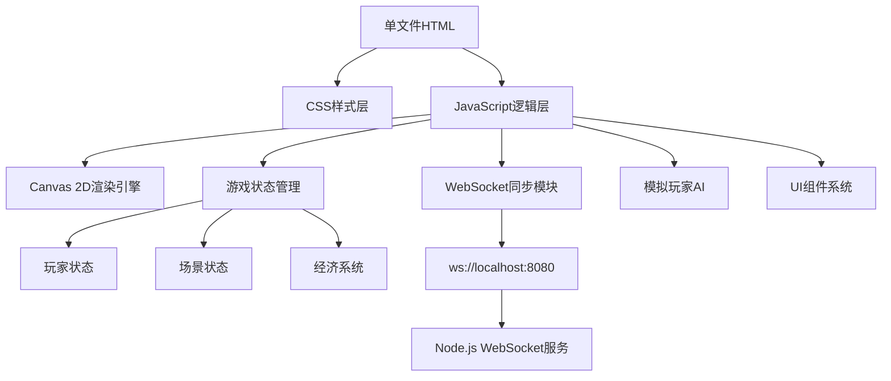
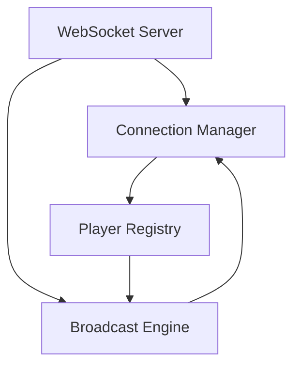
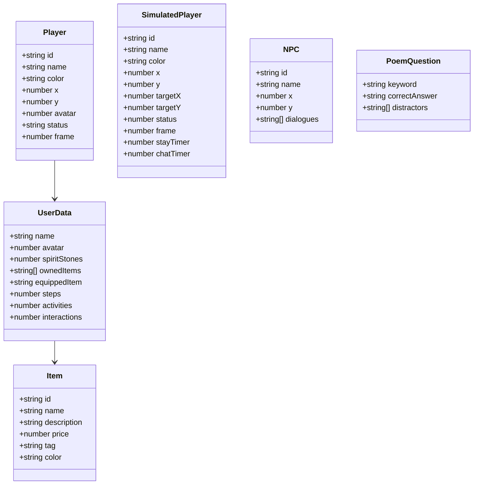

## 1. Architecture Design



## 2. Technology Description

- **前端**: 单文件HTML5 + CSS3 + JavaScript (ES6+)
- **渲染引擎**: Canvas 2D API
- **WebSocket**: 原生WebSocket API
- **后端**: 极简Node.js WebSocket服务（约80行）
- **状态管理**: 内存对象管理，无外部数据库

## 3. Route Definitions

| Route | Purpose |
|-------|---------|
| / | 角色创建页（入口） |
| /world | 主场景：云端仙山 |
| /activities | 活动页：诗词飞花令、婚礼宴请 |
| /market | 集市页：虚拟商品、社交动态 |
| /profile | 我页面：角色装扮、社交名片 |

## 4. API Definitions

### WebSocket消息格式

| Message Type | Direction | Schema |
|--------------|-----------|--------|
| join | Client→Server | `{ type: "join", name: string, color: string }` |
| leave | Client→Server | `{ type: "leave", id: string }` |
| move | Client→Server | `{ type: "move", id: string, x: number, y: number }` |
| chat | Client→Server | `{ type: "chat", id: string, message: string }` |
| playerList | Server→Client | `{ type: "playerList", players: Array<Player> }` |
| playerJoin | Server→Client | `{ type: "playerJoin", player: Player }` |
| playerLeave | Server→Client | `{ type: "playerLeave", id: string }` |
| playerMove | Server→Client | `{ type: "playerMove", id: string, x: number, y: number }` |
| playerChat | Server→Client | `{ type: "playerChat", id: string, message: string }` |

### Player对象结构
```typescript
interface Player {
  id: string;
  name: string;
  color: string;
  x: number;
  y: number;
  avatar: number; // 0:青衫书生, 1:粉衣少女, 2:白衣剑客
}
```

## 5. Server Architecture Diagram



## 6. Data Model

### 6.1 Data Model Definition



### 6.2 Data Definition Language

所有数据以内嵌JavaScript对象形式存储，无需数据库DDL。以下是核心数据结构：

**玩家预设数据:**
```javascript
const AVATARS = [
  { name: '青衫书生', color: '#60a5fa' },
  { name: '粉衣少女', color: '#f472b6' },
  { name: '白衣剑客', color: '#e5e7eb' }
];

const SIM_NAMES = [
  '云游书生', '青莲居士', '月下花影', '清风明月', 
  '墨香琴韵', '山水之间', '竹韵松风', '梅兰竹菊',
  '星河鹭起', '烟波钓徒'
];

const SIM_CHATS = [
  '今日仙山云海真美', '有人一起品茶吗', '刚在集市买了把新折扇',
  '这瀑布声真悦耳', '海棠花开得正好', '听说诗词比赛开始了',
  '想去参加婚礼宴请', '这风景令人心旷神怡', '修仙之路漫漫',
  '与君共赏此美景', '人生得意须尽欢', '花间一壶酒',
  '月上柳梢头', '清风徐来水波不兴', '采菊东篱下'
];
```

**商品数据:**
```javascript
const ITEMS = [
  { id: 'hanfu-qing', name: '汉服·青衫', price: 120, tag: '热门', color: '#60a5fa' },
  { id: 'hanfu-pink', name: '汉服·粉黛', price: 150, tag: '新品', color: '#f472b6' },
  { id: 'fan-shan', name: '折扇·山水', price: 80, tag: '热门', color: '#8b5cf6' },
  { id: 'hairpin-buyao', name: '发簪·步摇', price: 200, tag: '新品', color: '#fbbf24' },
  { id: 'lantern-glow', name: '灯笼·流光', price: 60, tag: '', color: '#f59e0b' },
  { id: 'jade-ruyi', name: '玉佩·如意', price: 300, tag: '稀有', color: '#06b6d4' },
  { id: 'scroll-bamboo', name: '书卷·竹简', price: 100, tag: '', color: '#a3e635' },
  { id: 'sword-white', name: '长剑·秋水', price: 500, tag: '稀有', color: '#e5e7eb' }
];
```

**诗词题目数据:**
```javascript
const POEMS = [
  { keyword: '月', correct: '床前明月光', distractors: ['白日依山尽', '黄河入海流', '欲穷千里目'] },
  { keyword: '花', correct: '人面不知何处去', distractors: ['春眠不觉晓', '处处闻啼鸟', '夜来风雨声'] },
  { keyword: '山', correct: '会当凌绝顶', distractors: ['举头望明月', '低头思故乡', '疑是地上霜'] }
];
```

## 7. 核心技术模块

### 7.1 等距视角渲染模块
- 等距坐标转换：`screenX = isoX - isoY`, `screenY = (isoX + isoY) / 2`
- 深度排序：根据Y坐标决定渲染顺序
- 场景元素绘制：山体、建筑、树木、瀑布、云雾

### 7.2 角色渲染模块
- 等距小人绘制：2帧走路动画
- 名称标签绘制
- 聊天气泡绘制
- 角色颜色区分

### 7.3 模拟玩家AI模块
- 随机目标点选择
- 路径移动（直线移动）
- 停留计时（2-5秒）
- 聊天触发（10-20秒随机）
- 社交距离检测（挥手动作）

### 7.4 WebSocket同步模块
- 连接管理：自动重连、失败回退
- 位置同步：客户端预测+服务器修正
- 聊天同步：消息广播
- 玩家加入/离开通知

### 7.5 经济系统模块
- 灵石余额管理
- 商品购买逻辑
- 物品所有权追踪
- 穿戴切换

### 7.6 UI组件模块
- Tab导航切换
- 卡片列表展示
- 弹窗对话框
- 动画效果系统
